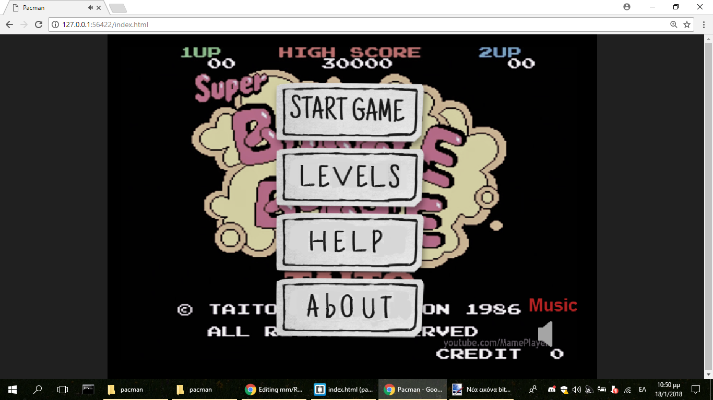
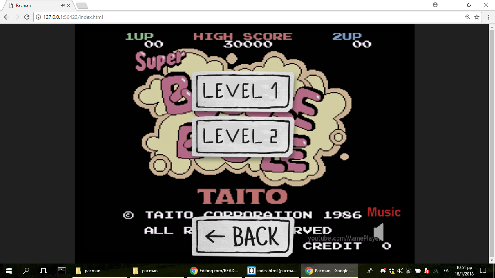
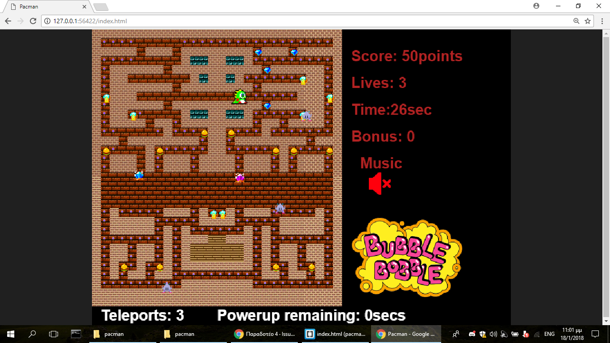
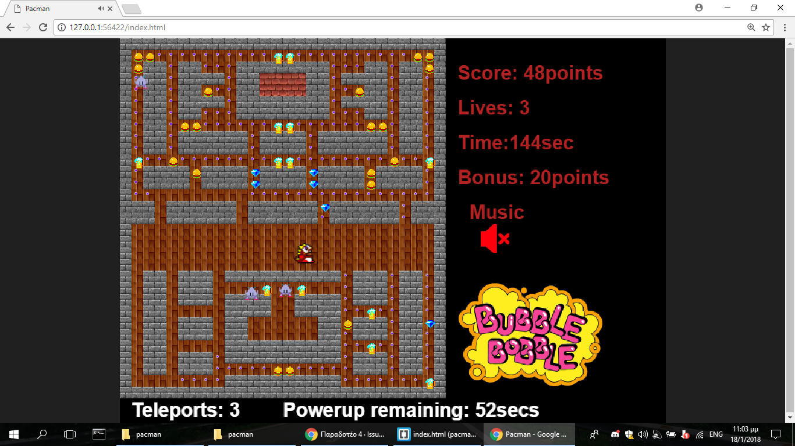
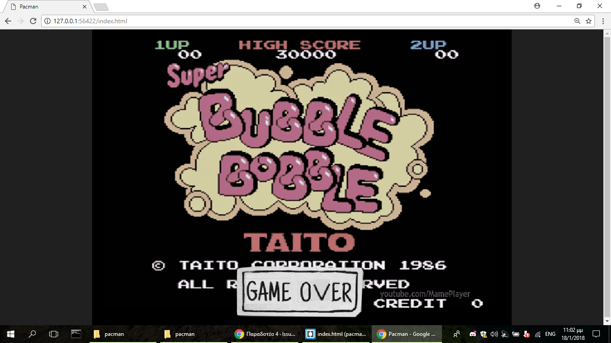

# Τελική Αναφορά

## Δημιουργία Pacman

### Σπυριδων θεοδωροπουλος Π2015035

Σύνδεσμος για το [ΑΠΟΘΕΤΗΡΙΟ MM](https://github.com/p15theo2/mm) 

Σύνδεσμος [ΑΠΟΘΕΤΗΡΙΟ PACMAN](https://github.com/p15theo2/pacman) 

Σύνδεσμος [PACMAN](https://p15theo2.github.io/pacman/) 

## Eισαγωγή  
Το θέμα που επιλέχτηκε ήταν η δημιουργία ενος νεου Pacman.Η εργασία βασίστηκε στο repository [pacman](https://github.com/ioniodi/pacman) το οποίο με την βοήθεια της βιβλιοθήκης phaser δίνει τα εργαλεία και τον απολύτως βασικό κώδικα για την ανάπτυξη ενως τέτοιου παιχνιδιου  

## Σύνοψη  
Έχουν ολοκληρωθεί όλα παραδοτέα της εργασίας.Αρχικά αντιγράφηκε το αποθετήριο [pacman](https://github.com/ioniodi/pacman) και στη συνέχεια έγιναν αλλαγές έτσι ώστε να ικανοποιηθούν τα βασικά ζητήματα αλλά και επιπλέον ζητήματα τα οποία προέκυψαν λόγω της ανάγκης δημιουργίας ενώς ποιο ολοκληρωμένου παιχνιδίου. 

## Επιλογή εργαλείων  
Για την ανάπτυξη της εργασίας χρησιμοποιήθηκε το πρόγραμμα BRACKETS .Για την επεξεργασία των εικόνων χρησιμοποιήθηκε το πρόγραμμα PAINT.NET .Οι γλώσσες που χρησιμοποιήθηκαν ήταν οι html και javascript.Η βιβλιοθήκη που χρησιμοποιήθηκε ηταν η phaser.Για την ευρεση των βοηθητικών εικόνων χρησιμοποιήθηκε η αναζήτηση εικόνων της GOOGLE.

## Διαδικασία ανάπτυξης  
Αρχικά μελετήθηκε ο κώδικας του αρχικού πακμαν και h συνέχεια η βιβλιοθήκη phaser .Στην συνέχεια ξεκίνησε η αναζήτηση στο διαδίκτυο επάνω στα ερωτήματα και στη συγγραφή του κώδικα. Ετσι δεσμέυτηκε το θέμα και αρχισε η ολοκλήρωση τον ερωτημάτων. 

## Για το δευτερο μερος της εργασιας προστεθηκαν τα παρακατω : 
- Νεος χαρτης με νεο tileset δημιουργημενος με την βοηθεια του tiled.

- Νεα dots π.χ διαμαντια , burgers κ.λπ.

- Νεος χαρακτηρας (Ο κυριος χαρακτηρας του παιχνιδιου bubble bobble ενος παλιου διασημου arcade game)

- Προστεθηκε μουσικη και ηχοι για το φαγωμα τον dot και τον bonus (στο φαγωμα των dots προστεθηκε επιπλεον κωδικας για ειναι λιγοτερο "ενοχλητικος" ο ηχος του "φαγωματος".Συγκεκριμενα ο ηχος ακουγεται μονο καθε 5 dots).

- Προστεθηκε κειμενο για score - bonus - χρονος - ζωες καθως και το logo του παιχνιδιου bubble bobble 

- Προστεθηκαν συναρτησεις και κουμπι με το οποιο ο χρηστης εφοσον το επιθυμει μπορει να σταματησει την μουσικη αλλα και στην συνεχεια να τον ξαναρχισει.

- Προστεθηκαν συναρτησεις για την επαναληψη της μουσικης μετα το τελος της.

- Προστεθηκε το "bonus dot" , ενα dot το οποιο εμφανιζεται και εξαφανιζεται ξαφνικα σε τυχαια σημεια του κεντρου του χαρτη . Οταν ο χαρακτηρας προλαβει να το "φαει" κερδιζει 10 bonus points και εμφανιζεται ενα κειμενο το οποιο ειδοποιει τον χρηστη οτι κερδισε 10 ποντους .

## Για το τριτο μερος της εργασιας προστεθηκαν τα παρακατω : 
 
- Προστεθηκαν τρια τερατα τα οποια κινουνται τυχαια και μπορουν να φανε τον ηρωα. 
  
- Προστεθηκε animation οταν ο ηρωας σκοτωνεται καθως και respawn αν ο παικτης εχει κι αλλες ζωες.

- Προστεθηκε η δυνατοτητα στον ηρωα να φαει τα τερατα για ενα χρονικο διαστημα συλλεγοντας τα κοκκινα διαμαντια καθως και animation και χρονο που δειχνουν οτι μπορει να φαει τερατα καθως και για ποσο χρονο ακομη. 

- Προστεθηκε η δυνατοτητα για teleport ο χρηστης εχει τρια teleport και μεταφερεται σε συγκεκριμενα σημεια στο κεντρο του χαρτη(το teleport γινεται πατωντας το spacebar).

- Το παιχνιδι σταματαει οταν ο ηρωας χασει και τις τρεις ζωες του .

- Προστεθηκε menu με κουμπια στο οποιο προς το παρον ο παικτης μπορει να ξεκινήσει το παιχνιδι να παρει βοηθεια αλλα και να δει πληροφοριες γυρω απο το παιχνιδι.

## Για το τεταρτο μερος της εργασιας προστεθηκαν τα παρακατω : 
- Νεος χαρτης .
- Ο χρηστης μπορεί να παίξει τον δεύτερο χαρτη ειτε επιλέγωντας τον απο το μενού ειτε τελειώνοντας το πρώτο χάρτη.
- κατατεθηκε χαρτη στον φακελο extesion.

## Ενδεικτικές οθόνες  

## Συμπεράσματα  
H εργασια ηταν μια πολλη καλη ευκαιρία για την κατανοηση της βιβλιοθήκης phaser καθως και την εισαγωγη στις γλωσσες html και javascript.
Επισης η  εργασία με βοήθησε να θυμηθώ τις λειτουργίες του github

